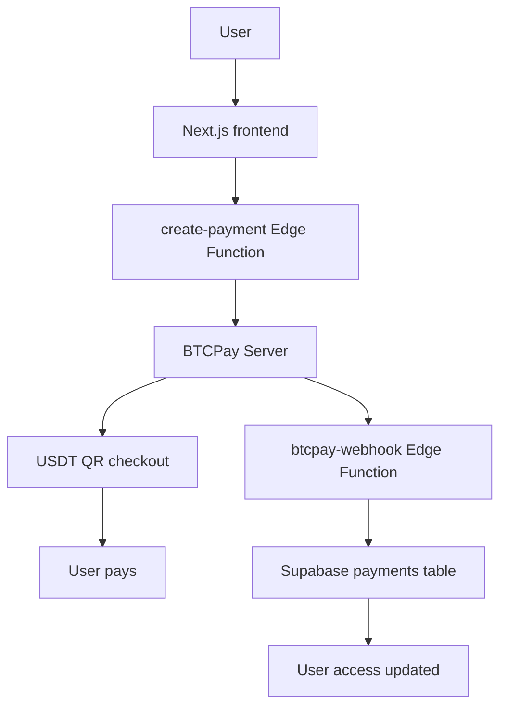

# Payment Flow

## Overview

This document describes the payment flow for USDT payments using BTCPay Server.

**Note:** This is a skeleton flow for Stage 0. Real implementation will be done in later stages.

## Flow Diagram

## Step-by-Step Flow

### 1. User Initiates Payment

- User clicks "Pay with USDT" button on profile page
- Frontend redirects to `/payment` page

### 2. Create Payment Invoice

- Frontend calls `create-payment` Edge Function
- Edge Function creates invoice in BTCPay Server
- BTCPay returns invoice ID and checkout URL

### 3. User Pays

- User is redirected to BTCPay checkout page
- BTCPay displays QR code for USDT payment
- User scans QR and sends USDT

### 4. Payment Confirmation

- BTCPay detects payment on blockchain
- BTCPay sends webhook to `btcpay-webhook` Edge Function
- Webhook verifies signature and updates payment status

### 5. Update User Access

- Edge Function updates `payments` table in Supabase
- Edge Function updates user profile with payment status
- User gets access to paid features

### 6. User Redirect

- BTCPay redirects user to success/cancel page
- Frontend displays payment status

## Payment States

### Invoice States (BTCPay)

- `new` - Invoice created, waiting for payment
- `processing` - Payment detected, waiting for confirmations
- `settled` - Payment confirmed, invoice complete
- `expired` - Invoice expired without payment
- `invalid` - Invalid payment or error

### Payment States (Database)

- `pending` - Payment initiated, waiting for confirmation
- `paid` - Payment confirmed and settled
- `failed` - Payment failed or invalid
- `expired` - Payment expired
- `cancelled` - Payment cancelled by user

## Security Considerations

### Webhook Verification

- Verify webhook signature using `BTCPAY_WEBHOOK_SECRET`
- Reject webhooks with invalid signatures
- Log all webhook attempts

### Payment Validation

- Never trust frontend payment status
- Always verify payment status from BTCPay
- Check payment amount matches expected amount
- Verify payment currency and network

### Access Control

- Only grant access after payment is `settled`
- Implement idempotency for webhook processing
- Handle duplicate webhooks gracefully

## Error Handling

### Payment Failures

- User cancels payment → redirect to `/payment/cancel`
- Payment expires → update status to `expired`
- Invalid payment → update status to `failed`

### Webhook Failures

- Log webhook errors
- Retry failed webhook processing
- Alert admin on repeated failures

## Testing (Future Stages)

### Test Scenarios

1. Successful payment flow
2. Cancelled payment
3. Expired payment
4. Invalid webhook signature
5. Duplicate webhook
6. Network errors

### Test Networks

- Use BTCPay testnet for development
- Test with small amounts on mainnet before production
- Verify all supported networks (Polygon, Tron, Ethereum)

## Implementation Stages

### Stage 0 (Current)

- ✅ Skeleton structure
- ✅ Placeholder pages
- ✅ Edge Function stubs

### Stage 1

- Supabase authentication
- Protected routes

### Stage 2

- User profiles
- Profile page with payment status

### Stage 3

- Real BTCPay integration
- Create payment invoices
- Payment page with checkout

### Stage 4

- Webhook verification
- Payment status updates
- Payment events logging

### Stage 5

- UI polish
- Error handling
- Loading states
